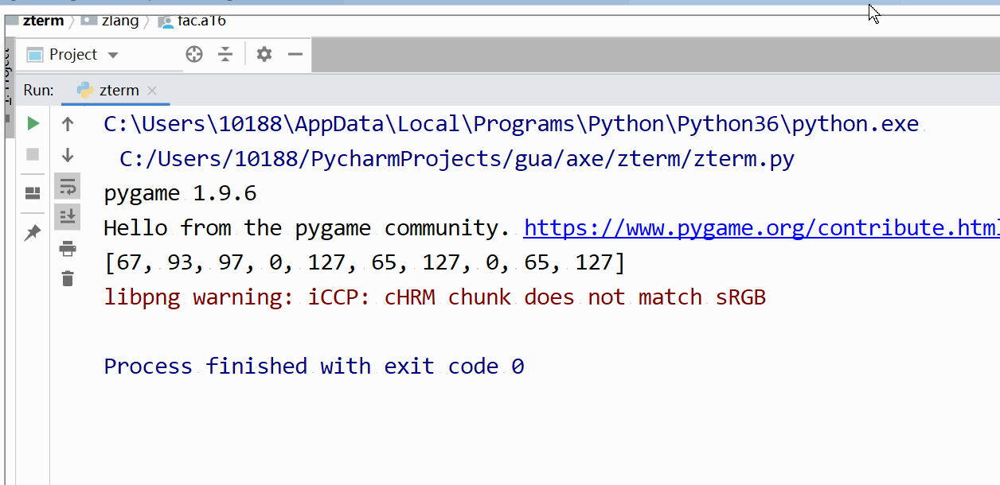

### zlang

#### 伪指令
    - .import_func
        - .import_func @factorial
        - 模块化编程
        - 自建汇编函数库
    - .function
        - .function @multiply 4
        - 声明函数及其参数空间
    - .call
        - .call @factorial x y
        - 调用函数, 传变量
    - .return
        - .return 4
        - 函数返回, 并销毁函数空间
    - .var2
        - .var2 x 2
        - 声明变量, 并赋值
    - .add
        - .add x y z
        - z = x + y
        - 加法操作
    - .addz
        - .addz x 2
        - 自增操作
    - .assign
        - .assign x y
        - 将 y 的值赋值给 x
    - .subtract
        - .subtract x y z
        - z = x - y
        - 减法操作
    - .if_less
        - .if_less x y
        - if x < y
        - 条件控制语句
        - 函数中支持多个 .if_less
    - .if_end
        - .if_end
        - 控制语句结束
        - 函数中支持多个 .if_end
    - .while_less
        - .while_less x y
        - while x < y
        - 循环控制语句
        - 函数中支持多个 .while_less
    - .while_end
        - .while_end
        - 循环控制结束
        - 函数中支持多个 .while_end
    - .set
        - .set x
        - 将寄存器 a1 的值赋值给 x
        - 用于获取函数返回值
    - .get
        - .get x
        - 寄存器 a1 获取变量 x 的值
    - .save
        - .save x y
        - 将变量 x 的值存到地址为变量 y 的值上
    - .load
        - .load x y
        - 从地址为变量 x 的值上获取值赋给变量 y
    - .shift_right
        - .shift_right x 2
        - 变量 x 右移两位
    - .and
        - .and x y z
        - 变量 x 与 y 做按位与运算, 结果给变量 z

### zdrawer
    - 汇编函数
        - @draw_point
        - @draw_line_h
        - @draw_char
        - @multiply
        - @factorial
    - 汇编接口文件
        - 模板语法 {color}
    - python 接口
        - draw_point(x, y, color)
        - draw_char('A', x, y, color)
    - draw_char
        - 支持 26 个大写字母以及 10 个数字与 $ 符号
#### zterm
    - pygame 搭建的虚拟显示器
    - 调用 zdrawer 的 python 接口执行汇编
    - todo
        - 类 terminal 的终端
